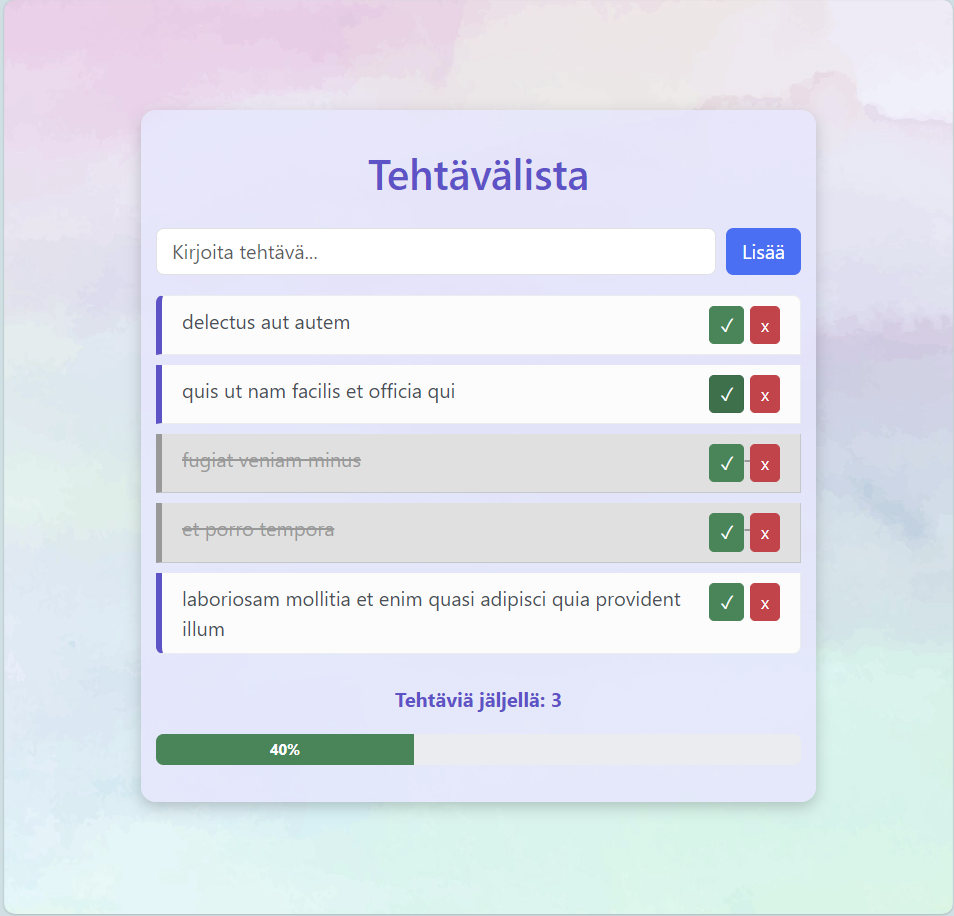

# Tehtävälista – Projekti 3 (JS-kirjastot)

## 👤 Projektin nimi ja tekijät
**Tehtävälista**  
Tekijä: Tinja Pennanen  
(Yksilötyö – ei parityötä)

---

## 🔗 Verkkolinkit
- **Julkaistu sovellus:** [Katso sovellus Netlifyssa](https://tehtavalistajava.netlify.app/)
- **Esittelyvideo:** [Katso demovideo Laurean videopalvelussa](https://video.laurea.fi/media/Teht%C3%A4v%C3%A4lista/0_zhru9jvi)
- **GitHub-repositorio:** [Avaa GitHub-projekti](https://github.com/pennanentinja/ToDo-java)

---

## 🤝 Työn jakautuminen
Tein projektin yksin. Vastasin kaikista vaiheista: suunnittelusta, toteutuksesta, testauksesta, dokumentoinnista ja julkaisemisesta. Hyödynsin Copilotin apua erityisesti siinä, miten ulkoisia kirjastoja (jQuery, Axios, Bootstrap) kannattaa integroida ja miten visuaalisia efektejä voi lisätä. Lopuksi viimeistelin sovelluksen ja tein README:n.

---

## 📈 Oma arvio työstä ja oman osaamisen kehittymisestä
Projektissa onnistuin mielestäni hyvin hyödyntämään ulkoisia kirjastoja ja tekemään sovelluksesta monipuolisemman kuin alkuperäinen natiivilla JavaScriptillä toteutettu versio. Sovellus toimii vakaasti, ja lisätyt efektit (progress bar ja konfetti) tuovat siihen näyttävyyttä. Opin projektin aikana paljon jQueryn käytöstä DOM-skriptauksessa, Axiosin avulla tehtävien hakemisesta ulkoisesta API:sta sekä Bootstrapin hyödyntämisestä käyttöliittymän parantamisessa. 
**Arvioisin oman suoritukseni: 7,5/10 p**

---

## 🗣️ Palaute opettajalle kurssista sekä itse opetuksesta tähän saakka
Kurssi on ollut erittäin hyödyllinen ja käytännönläheinen. Ulkoisten kirjastojen käyttöön liittyvät tehtävät auttoivat ymmärtämään, miten sovelluksia voi laajentaa ja tehdä niistä ammattimaisempia. Opettajan palaute ja ohjaus ovat olleet selkeitä ja auttaneet etenemään projektissa.

---

## 📚 Sisällysluettelo
- [Tietoja sovelluksesta](#tietoja-sovelluksesta)
- [Tunnetut virheet/bugit](#tunnetut-virheetbugit)
- [Kuvakaappaukset](#kuvakaappaukset)
- [Teknologiat](#teknologiat)
- [Asennus](#asennus)
- [Lähestymistapa](#lähestymistapa)
- [Kiitokset](#kiitokset)
- [Lisenssi](#lisenssi)

---

## 📦 Tietoja sovelluksesta
**Tehtävälista** on selainpohjainen sovellus, jossa käyttäjä voi:
- Lisätä tehtäviä
- Merkitä tehtäviä tehdyiksi
- Poistaa tehtäviä
- Seurata tehtävien määrää laskurin ja progress barin avulla

Sovellus hyödyntää ulkoisia kirjastoja:
- jQuery DOM-skriptaukseen ja animaatioihin
- Axios tehtävien hakemiseen ulkoisesta API:sta (JSONPlaceholder)
- Bootstrap käyttöliittymän tyylittelyyn
- Lisäksi sovelluksessa on konfettianimaatio, joka käynnistyy kun kaikki tehtävät on tehty.

---

## 🐞 Tunnetut virheet/bugit
Sovellus toimii testien perusteella odotetusti. En ole havainnut merkittäviä bugeja, jotka haittaisivat käyttöä.

---

## 🖼️ Kuvakaappaukset
  
*Kuva: Tinja Pennanen*

---

## 🛠️ Teknologiat
Käytin seuraavia teknologioita:
- **HTML** – rakenteen luomiseen
- **CSS** – ulkoasun muotoiluun
- **JavaScript (jQuery)** – DOM-skriptaukseen ja animaatioihin
- **Axios** – AJAX-kutsuihin ulkoiseen API:iin
- **Bootstrap** – käyttöliittymän tyylittelyyn
- **Canvas-confetti** – visuaaliseen konfettiefektiin

---

## 🚀 Asennus
1. Lataa tai kloonaa repositorio GitHubista
2. Avaa `index.html` tiedosto selaimessa
3. Sovellus toimii suoraan ilman lisäasennuksia

---

## 🧭 Lähestymistapa
Projektin eteneminen:
- Suunnittelin käyttöliittymän ja värimaailman
- Toteutin lomakkeen ja listan jQueryllä
- Lisäsin Axios-haun ulkoisesta API:sta
- Rakensin progress barin ja konfettiefektin
- Viimeistelin ulkoasun Bootstrapilla
- Julkaisin sovelluksen Netlifyyn ja dokumentoin README.md-tiedoston

---

## 🙏 Kiitokset
- [Opettajan antama materiaali](https://mika-stenberg.gitbook.io/web-sovelluksia-javascriptin-avulla)
- [Netlify – Deployment](https://www.netlify.com/)
- [Ws3 school](https://www.w3schools.com/java/)
- **Microsoft Copilot** – AI-avustaja projektin suunnittelussa, koodin tarkistuksessa ja dokumentoinnissa

---

## 📄 Lisenssi
Tämä projekti on lisensoitu MIT-lisenssillä.  
© Tinja 2025